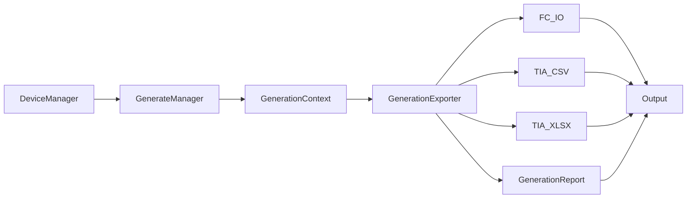

# EEDP

Electrical Engineering Development Platform for PLC engineering automation.

## Features

- FC_IO Generator
- Siemens TIA Tag CSV Generator
- Siemens TIA Portal V20 XLSX Generator
- Generate Framework
- Generation Report
- Output Management

## Project Structure

```text
app/
docs/
library/
output/
resources/
scripts/
tests/
```

## Requirements

- Python 3.11+

Required packages:

- PySide6
- pandas
- openpyxl
- pyyaml

## Installation

```bash
git clone https://github.com/winkhu84/EEDP.git
cd EEDP
python -m venv .venv
```

Activate the virtual environment:

```bash
# Windows (PowerShell)
.\.venv\Scripts\Activate.ps1

# macOS / Linux
source .venv/bin/activate
```

Install dependencies:

```bash
pip install -r requirements.txt
```

## Current Version

**Current Release:** v0.3

Generate Framework completed.

## Architecture

EEDP builds engineering deliverables through a layered flow: project devices are managed in memory, then `GenerateManager` creates a shared `GenerationContext` and runs exporters that each produce one artifact into a timestamped output folder.



## Usage

### Start the application

```bash
python main.py
```

### Generate deliverables (framework)

```python
from app.engine.generate_manager import GenerateManager, GenerationOptions
from app.model.device import Device

devices: list[Device] = []  # project devices
options = GenerationOptions(
    generate_fc_io=True,
    generate_tia_csv=True,
    generate_tia_xlsx=True,
    create_run_subdirectory=True,
)

result = GenerateManager().generate(
    output_directory="output/generated",
    options=options,
    devices=devices,
)

print(result.output_directory)
for artifact in result.artifacts:
    print(artifact.artifact_type, artifact.status.value, artifact.output_path)
```

Each run writes files into a timestamped folder under the selected output directory and creates `Generation_Report.txt`.

## Generated Files

Each generation run creates a unique timestamped folder so previous
results are not overwritten.

```text
output/
└── 20260720_150301/
    ├── FC_IO.xlsx
    ├── TIA_Tags.csv
    ├── TIA_V20_Tags.xlsx
    └── Generation_Report.txt
```

| File | Description |
|------|-------------|
| **FC_IO.xlsx** | Project PLC I/O workbook for engineering review and export |
| **TIA_Tags.csv** | Siemens-compatible PLC tag table in CSV format |
| **TIA_V20_Tags.xlsx** | Siemens TIA Portal V20 import workbook |
| **Generation_Report.txt** | Summary of generated artifacts, statuses, and counts |

## Current Status

Current Release: **v0.3**

| 🟢 Completed | 🔵 In Progress | 🟣 Planned |
|--------------|---------------|-----------|
| Generate Framework | Device Manager | PLC Source Generator |
| FC_IO Generator | Generate UI | DB Generator |
| Siemens TIA CSV Generator |  | EPLAN Generator |
| Siemens TIA Portal V20 XLSX Generator |  | |
| Generation Report |  | |
| Repository Cleanup |  | |
| GitHub Release |  | |

## Roadmap

| Phase | Focus | Target |
|------|----------------------------|----------------|
| Phase 1 | Generate Framework | ✅ Complete |
| Phase 2 | Device Manager + UI | 🚧 In Progress |
| Phase 3 | PLC Source Generator | 📅 Planned |
| Phase 4 | DB Generator | 📅 Planned |
| Phase 5 | EPLAN Generator | 📅 Planned |
