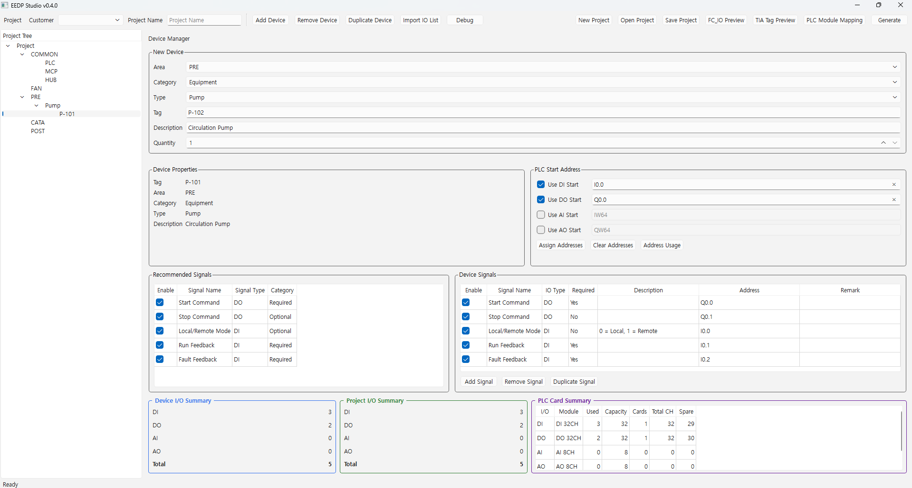
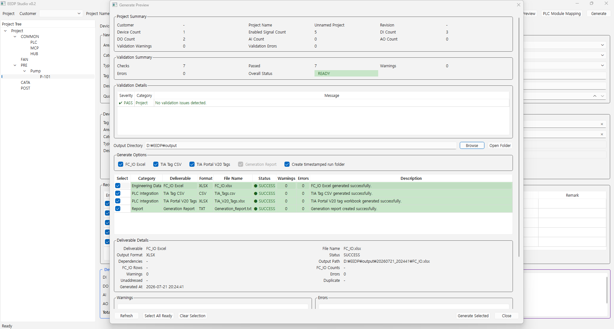
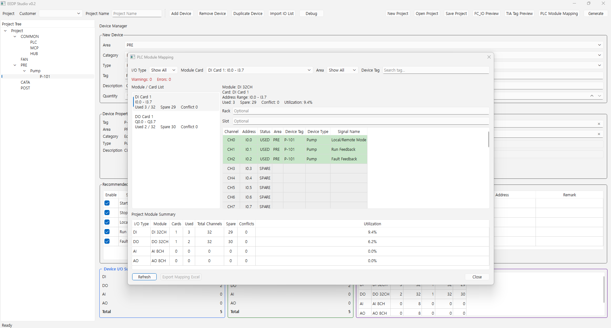
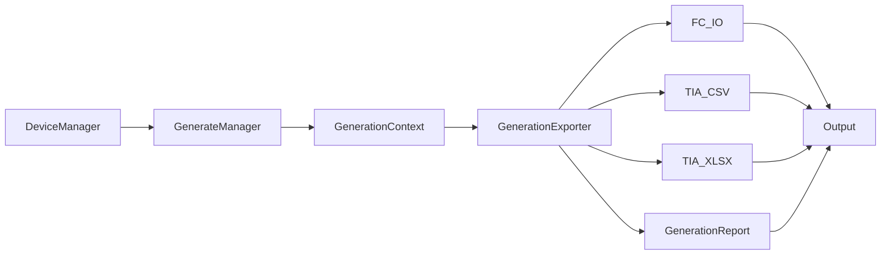

# EEDP Studio

Electrical Engineering Development Platform

PLC Engineering Automation Platform for Siemens TIA Portal and EPLAN


## Overview

EEDP Studio is a PLC engineering automation platform that turns project device and signal data into Siemens-ready deliverables and validation reports.

It automates:

- Device and signal management
- PLC address assignment
- FC_IO generation
- Siemens TIA Tag CSV generation
- Siemens TIA Portal V20 XLSX generation
- PLC module mapping
- Generate Preview
- Validation and engineering reports

## Key Features

### Engineering

| Feature | Status |
|---------|:------:|
| Device Manager | ✅ |
| Recommended Signals | ✅ |
| PLC Address Assignment | ✅ |
| Validation Summary | ✅ |
| Validation Details | ✅ |

### Siemens Integration

| Feature | Status |
|---------|:------:|
| FC_IO Export | ✅ |
| Siemens TIA Tag CSV | ✅ |
| Siemens TIA Portal V20 XLSX | ✅ |
| PLC Module Mapping | ✅ |

### Productivity

| Feature | Status |
|---------|:------:|
| Generate Preview | ✅ |
| Timestamped Output Folder | ✅ |
| Generation Report | 🚧 |
| Engineering Reports | 🚧 |

EEDP Studio reduces repetitive PLC engineering work by automatically
generating standardized engineering deliverables for Siemens-based projects.

## Architecture

```text
EEDP Studio
│
├── User Interface
│   ├── Main Window
│   ├── Device Manager
│   ├── Generate Preview
│   └── PLC Module Mapping
│
├── Engineering Core
│   ├── Validation Engine
│   ├── Address Assignment
│   ├── Recommended Signals
│   └── Project Management
│
├── Export Engine
│   ├── FC_IO
│   ├── Siemens TIA CSV
│   ├── Siemens TIA Portal XLSX
│   ├── Reports
│   └── Output Management
│
└── Project Data
    ├── Devices
    ├── Signals
    ├── PLC Addresses
    └── Settings
```

## Project Structure

| Folder | Purpose |
|---------|---------|
| app/ | Application source code |
| app/ui/ | User interface |
| app/core/ | Engineering logic |
| app/export/ | Export generators |
| app/models/ | Data models |
| docs/ | Documentation |
| output/ | Generated engineering files |

The project follows a layered architecture that separates the user interface,
engineering logic, export modules and project data.
This structure improves maintainability, scalability and future feature development.

## Screenshots

<table>
<tr>
<td align="center" width="33%">
<b>Main Window</b><br><br>
<a href="docs/images/main_window.png"></a>
<br><br>
Project management and device engineering workspace.
</td>
<td align="center" width="33%">
<b>Generate Preview</b><br><br>
<a href="docs/images/generate_preview.png"></a>
<br><br>
Validation summary, deliverables and generation workflow.
</td>
<td align="center" width="33%">
<b>PLC Module Mapping</b><br><br>
<a href="docs/images/plc_module_mapping.png"></a>
<br><br>
Automatic Siemens PLC module mapping and address visualization.
</td>
</tr>
</table>

<p><em>Screenshots will be updated as new features are introduced.</em></p>

## Quick Links

- [Installation](#installation)
- [Architecture](#architecture)
- [Project Structure](#project-structure)
- [Screenshots](#screenshots)
- [Generation Flow](#generation-flow)
- [Usage](#usage)
- [Generated Files](#generated-files)
- [Current Status](#current-status)
- [Roadmap](#roadmap)

## Features

- FC_IO Generator
- Siemens TIA Tag CSV Generator
- Siemens TIA Portal V20 XLSX Generator
- Generate Framework
- Generation Report
- Output Management

## Requirements

- Python 3.11+

Required packages:

- PySide6
- pandas
- openpyxl
- pyyaml

## Installation

```bash
git clone https://github.com/winkhu84/EEDP.git
cd EEDP
python -m venv .venv
```

Activate the virtual environment:

```bash
# Windows (PowerShell)
.\.venv\Scripts\Activate.ps1

# macOS / Linux
source .venv/bin/activate
```

Install dependencies:

```bash
pip install -r requirements.txt
```

## Current Version

**Current Release:** v0.3

Generate Framework completed.

## Generation Flow

EEDP builds engineering deliverables through a layered flow: project devices are managed in memory, then `GenerateManager` creates a shared `GenerationContext` and runs exporters that each produce one artifact into a timestamped output folder.



## Usage

### Start the application

```bash
python main.py
```

### Generate deliverables (framework)

```python
from app.engine.generate_manager import GenerateManager, GenerationOptions
from app.model.device import Device

devices: list[Device] = []  # project devices
options = GenerationOptions(
    generate_fc_io=True,
    generate_tia_csv=True,
    generate_tia_xlsx=True,
    create_run_subdirectory=True,
)

result = GenerateManager().generate(
    output_directory="output/generated",
    options=options,
    devices=devices,
)

print(result.output_directory)
for artifact in result.artifacts:
    print(artifact.artifact_type, artifact.status.value, artifact.output_path)
```

Each run writes files into a timestamped folder under the selected output directory and creates `Generation_Report.txt`.

## Generated Files

Each generation run creates a unique timestamped folder so previous
results are not overwritten.

```text
output/
└── 20260720_150301/
    ├── FC_IO.xlsx
    ├── TIA_Tags.csv
    ├── TIA_V20_Tags.xlsx
    └── Generation_Report.txt
```

| File | Description |
|------|-------------|
| **FC_IO.xlsx** | Project PLC I/O workbook for engineering review and export |
| **TIA_Tags.csv** | Siemens-compatible PLC tag table in CSV format |
| **TIA_V20_Tags.xlsx** | Siemens TIA Portal V20 import workbook |
| **Generation_Report.txt** | Summary of generated artifacts, statuses, and counts |

## Current Status

Current Release: **v0.3**

| 🟢 Completed | 🔵 In Progress | 🟣 Planned |
|--------------|---------------|-----------|
| Generate Framework | Device Manager | PLC Source Generator |
| FC_IO Generator | Generate UI | DB Generator |
| Siemens TIA CSV Generator |  | EPLAN Generator |
| Siemens TIA Portal V20 XLSX Generator |  | |
| Generation Report |  | |
| Repository Cleanup |  | |
| GitHub Release |  | |

## Roadmap

| Phase | Focus | Target |
|------|----------------------------|----------------|
| Phase 1 | Generate Framework | ✅ Complete |
| Phase 2 | Device Manager + UI | 🚧 In Progress |
| Phase 3 | PLC Source Generator | 📅 Planned |
| Phase 4 | DB Generator | 📅 Planned |
| Phase 5 | EPLAN Generator | 📅 Planned |
